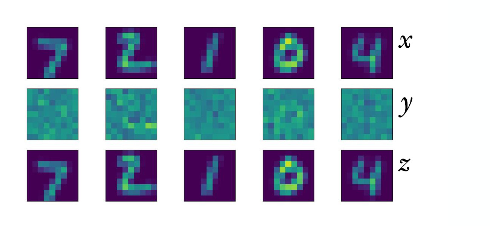
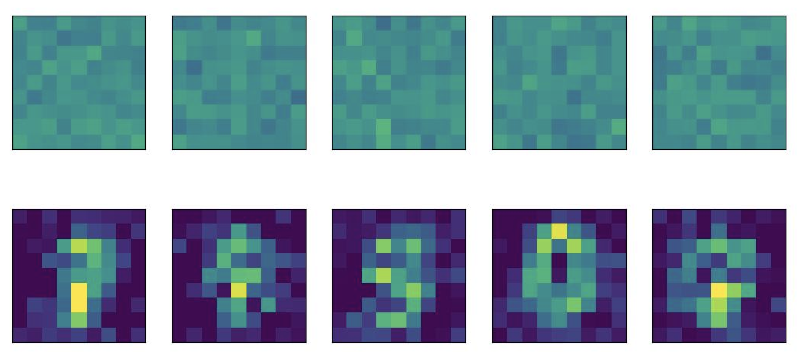

# sylvestorch
A Pytorch implementation of Sylvester normalizing flows

## Sylvester Normalizing Flows

Normalizing Flows are transformations $`y=f(x)`$ for which we require two key properties:
1. **Invertibility**, i.e. $`f^{-1}`$ exists (and is tractable)
2. **Density estimation**, i.e. the determinant of the Jacobian of $`f`$ is tractable (and differentiable)

### Original formulation

[Sylvester Normalizing Flows](https://arxiv.org/abs/1803.05649) achieve these by taking a traditional residual block, $`f(x) = x + L_2 h(L_1 x + b)`$, and imposing constraints on $`L_1`$ and $`L_2`$. Namely, they parameterize $`L_1`$ as $`L_1 = R_1 Q^t`$ and $`L_2`$ as $`L_2 = QR_2`$, so that

```math
f(x) = x + QR_2h(R_1 Q^t + \mathbf{b})
```

where $`Q`$ is an orthonormal matrix, $`R_1`$ and $`R_2`$ are upper triangular matrices with appropriate diagonal values, $`h`$ is a non-linear (smooth, bounded) activation function, and $`b`$  is a learned constant vector. 

This is implemented by `layers.SylvesterBlock` and used by `models.SylvesterNet`.

### Generalized Sylvester

[Generalized Sylvester Flows](https://arxiv.org/abs/2006.01910) use the following formulation for its layers:

```math
f(x) = x + W^{-1}f_{AR}(Wx)
```

where $`W`$ can be any invertible matrix, and $`f_{AR}`$  is a smooth autoregressive function.

Particularly, $`f_{AR}`$ is expressed as: 

```math
f_{AR}(x) = \gamma s_2(x) tanh(x s_1(x) + t_1(x)) + t2(x)
```

This is implemented by `layers.GeneralizedSylvesterBlock` and used by `models.GeneralizedSylvesterNet`.

## Usage

`sylvestorch` uses the [torch.nn.utils.parametrize](https://docs.pytorch.org/docs/stable/generated/torch.nn.utils.parametrize.register_parametrization.html) module to enforce the required constraints on the residual blocks. 

```
net = SylvesterNet( n_layers=4,    # number of residual blocks
                    input_size=32, # dimension of input and output
                    hidden_size=32 # dimension after projection by Q^t
                                   # 1 <= hidden_size <= input_size
                  )

x = torch.randn(100, 32)  # batch_size=100, input_size=32
y, log_det = net(x)
z = net.inverse(y)

assert torch.allclose(x, z)

```

### As an invertible transformation

The Sylvester network can map data between spaces, e.g. from the MNIST manifold to a latent space ( $y = f(x)$ ). 
This transformation is invertible, i.e.
```math
z = f^{-1}(y) = f^{-1}(f(x)) = x
```


### As a generative model

The inverse network transformation $f^{-1}$ can be used on a random samples to generate data from the original space.



